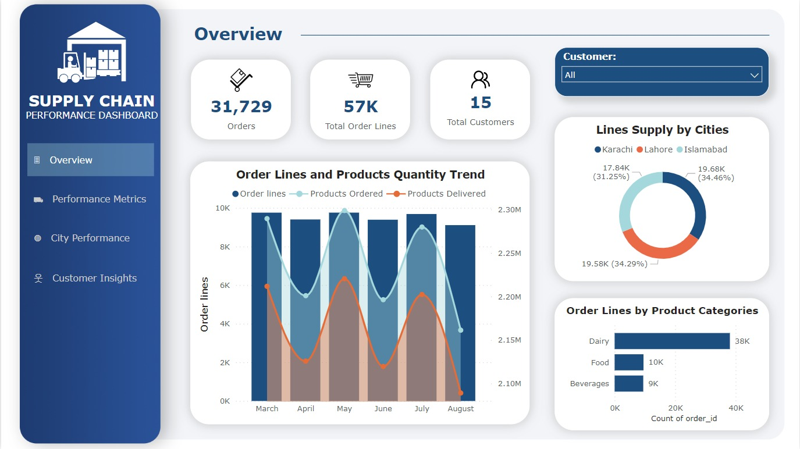

# FMCG Mart Supply Chain Analysis
This is end-to-end project of Supply Chain in Fast-Moving Consumer Goods(FMCG) domain, in which a real business problem is solved and provided useful insights on an interactive dashboard to the stakeholders using Power BI.

## Problem Statement
AtliQ Mart is a growing FMCG manufacturer headquartered in Gujarat, India. It is currently operational in three cities Surat, Ahmedabad and Vadodara. They want to expand to other metros/Tier 1 cities in the next 2 years.

AtliQ Mart is currently facing a problem where a few key customers did not extend their annual contracts due to service issues. It is speculated that some of the essential products were either not delivered on time or not delivered in full over a continued period, which could have resulted in bad customer service. Management wants to fix this issue before expanding to other cities and requested their supply chain analytics team to track the ’On time’ and ‘In Full’ delivery service level for all the customers daily basis so that they can respond swiftly to these issues.

The Supply Chain team decided to use a standard approach to measure the service level in which they will measure ‘On-time delivery (OT) %’, ‘In-full delivery (IF) %’, and OnTime in full (OTIF) %’ of the customer orders daily basis against the target service level set for each customer.

## Task
Peter Pandey is the data analyst in the supply chain team who joined AtliQ Mart recently. He has been briefed about the the task in the stakeholder business review meeting. Now imagine yourself as Peter Pandey and play the role of the new data analyst who is excited to build this dashboard and perform the following task:

- Create the metrics according to the metrics list.

- Create a dashboard according to the requirements provided by stakeholders in the business review meeting. You will be provided with the transcript of this business review meeting in comic form.

- Create relevant insights not provided in the metric list/stakeholder meeting.

## Data Model

## Dashboard

Live Dashboard: <a href="https://app.powerbi.com/view?r=eyJrIjoiMjM4ZjFiNDItOGMyNC00NjhlLTg4ZGQtZjQxMDFlNzNjNWU3IiwidCI6ImRmODY3OWNkLWE4MGUtNDVkOC05OWFjLWM4M2VkN2ZmOTVhMCJ9&pageName=ReportSection6b7ea69cca3d2b394a4a">Click Here</a>

## Key Insights: 
- Dairy products are in majority.
- Products are not being delivered in full ordered quantity.
- All the perfomance metrics(OT%, IF%, OTIF%) are below the target, the mart supply chain is not performing good.
- Line Fill Rate is 65.96%, it means many of the orders are not being delivered in full quantity.
- Volume Fill Rate is around 96%, it means there is 4% difference in the quantity of items when they reached the customers.
- There is no noticeable improvements in any of the key metrics in the last few months.
- There is a big in IF% vs Target for most of the customers. Is it because of less production?
- Lotus Mart, Coolblue and Acclaimed Stores are among the customers with highest number of orders but also most delayed delivery rate.

